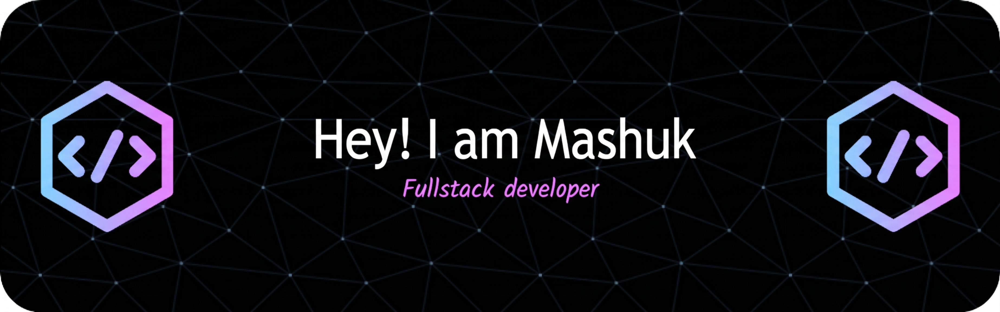

<div align="center">



# Mashuk-ur Rahman

### Student | Software Developer • Backend • AI Engineering

<p>
  <a href="https://github.com/mashukurmanilk">
    
  </a>
  <a href="https://www.linkedin.com/in/ur-manik-8055382a2/">
    
  </a>
  <a href="mailto:mashukurmanik2552@gmail.com">
    
  </a>
</p>

</div>

---

## 👨‍💻 About Me

I'm a student and software developer interested in building practical software and understanding the systems behind it.

My current focus is **backend development, system design, and AI engineering**, while continuing to build my foundations in **data science and machine learning**.

I enjoy learning by building — turning ideas into working projects, understanding how systems work under the hood, and gradually moving from simple applications toward scalable, AI-powered systems.

---

## 🚀 Currently Working On

* 🔧 Building stronger backend skills with **Node.js, TypeScript, APIs, and databases**
* ⚡ Exploring **Next.js** and modern full-stack development
* 🏗️ Learning **system design, Docker, deployment, caching, and scalable backend architecture**
* 🤖 Exploring **LLM APIs, RAG, LangGraph, and AI-powered applications**
* 🌐 Building projects with **React, WebRTC, and real-time communication**
* 📊 Continuing to develop skills in **data science and machine learning**

---

## 🛠️ Tech Stack

### 💻 Languages

<p align="left">
  
</p>

### 🌐 Web & Backend

<p align="left">
  
</p>

### 🗄️ Databases & Data

<p align="left">
  
</p>

### 🤖 AI & Machine Learning

<p align="left">
  
</p>

### ⚙️ Tools & Infrastructure

<p align="left">
  
</p>

---

## 🧠 What I'm Learning

```text
Backend Engineering       ███████████████████░░
System Design             ███████████████░░░░░
AI Engineering            ██████████████░░░░░░
Data Science / ML         ███████████████░░░░░
Frontend / Next.js        ████████████████░░░░
DevOps / Deployment       ██████████░░░░░░░░░░
```

> Building depth in backend and systems while developing breadth across AI and machine learning.

---

## 🎯 Featured Areas

| Area                  | Focus                                                                              |
| --------------------- | ---------------------------------------------------------------------------------- |
| 🔧 **Backend**        | Node.js, TypeScript, REST APIs, databases, authentication, RBAC                    |
| 🏗️ **Systems**       | System design, caching, WebSockets, Docker, reverse proxies, scalable architecture |
| 🤖 **AI Engineering** | LLM APIs, RAG, transformers, LangGraph, AI-powered applications                    |
| 📊 **Data / ML**      | Python, NumPy, pandas, EDA, classical ML, model evaluation and tuning              |
| 🌐 **Frontend**       | React, Next.js, state management, API integration, real-time applications          |

---


## 🔥 GitHub Streak

<div align="center">

<a href="https://github.com/mashukurmanilk">
  
</a>

</div>

---

## 📚 Current Focus

```text
        Backend
           │
           ▼
     System Design
           │
           ▼
     AI Engineering
           │
     ┌─────┴─────┐
     ▼           ▼
   LLMs         RAG
     │           │
     └─────┬─────┘
           ▼
    AI-Powered Systems
```

My goal is to become a **T-shaped software engineer** — developing deep expertise in backend engineering, system design, and AI engineering while maintaining broad knowledge across frontend development, data science, and machine learning.

---

## 🤝 Connect With Me

<div align="center">

<a href="https://github.com/mashukurmanilk">
  
</a>
&nbsp;
<a href="https://www.linkedin.com/in/ur-manik-8055382a2/">
  
</a>
&nbsp;
<a href="mailto:mashukurmanik2552@gmail.com">
  
</a>

</div>

---

<div align="center">

### 💭

*"Small steps every day, big results over time."*

<br>

⭐ Thanks for visiting my profile!

</div>
